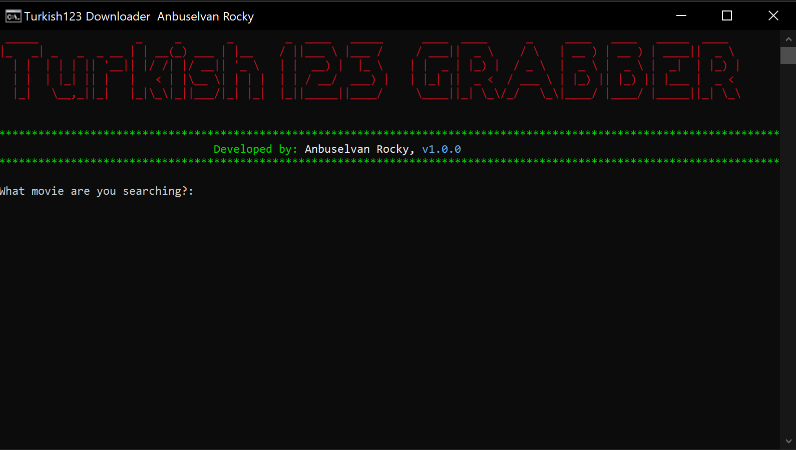
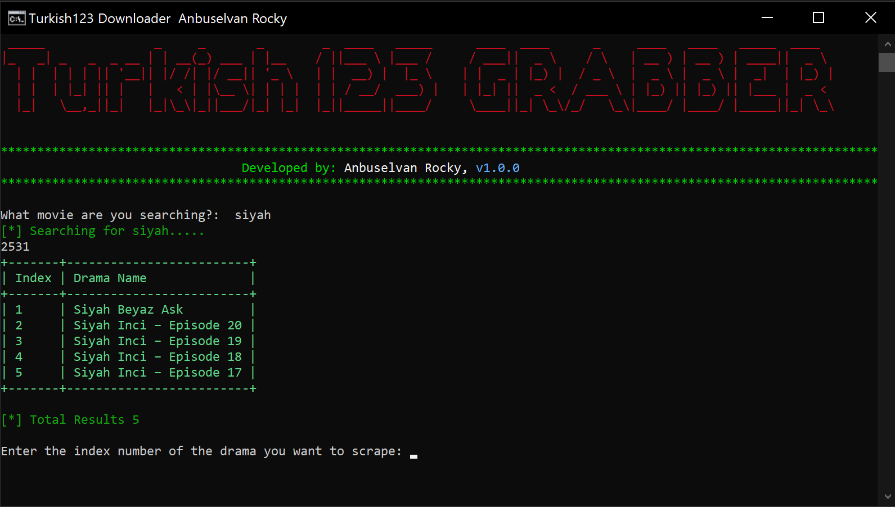
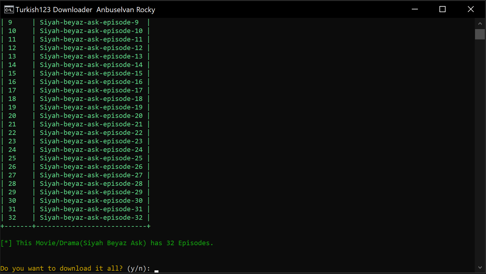
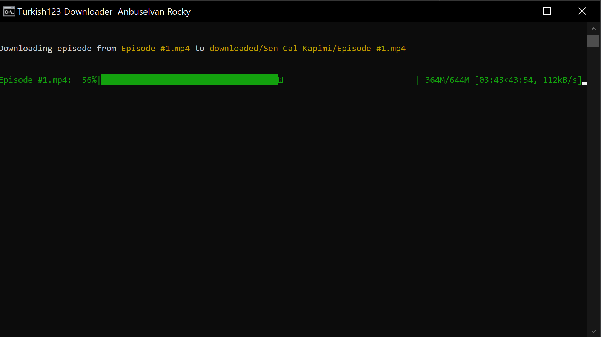
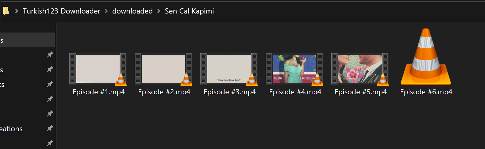

# Turkish123 Downloader


Turkish123 Downloader that allows people to download all type of movies(drama or normal movie) in a single click.

It can run on Windows, Linux and Mac using the advantage of Python executables.

## How it works?
1. Install Python and run the application by clicking `start.bat`(if you are using windows), it will open this.

 	

2. Enter what **`movie/drama`** which you want to download.

     (Make sure, that `movie/drama` should be present in <a href="https://turkish123.com" target="_blank">turkish123.com</a> website, if it is not available in that website, this app can't crawl and hence, download it.)
   


3. It will get all episodes of that particular `movie/drama` and will **prompt** you, if you want to download it all?. 
   
    
    Type `y` and press `Enter` key.



4. It should download all episodes one by one and save it in `downloaded/drama_folder`. 



5. Once all the download finishes, open the `downloaded/drama_folder` and watch the movie/drama offline.

 	

>(**<span style="color:#FFA500">Note:</span>** You should have good internet connection to have <span style="color:#66ff00">seamless download experience</span>.)

>(**<span style="color:#FFA500">Note:</span>** You can also transfer it to any mobile  and watch it there. 📱)
	


## Prerequisites

Before you begin, ensure you have met the following requirements:

* You have installed the latest version of <a href="https://www.python.org/downloads/" target="_blank">Python 3.9+</a>
  in your system, If you don't have these, download it from <a href="https://www.python.org/downloads/" target="_blank">
  here</a>
* You have an active Internet connection to download it from web 🌍.
* Check if you have installed successfully by `python --version`, `pip --version`, if it prints the version, it is installed perfectly. If not, install it yourself 💻! 

## Installing dependencies
```bash
pip install -r requirements.txt
```

## Running Turkish123 Downloader
To run Turkish123 Downloader, follow these steps:

**If you are using Windows:**
- Just click `start.bat` and it will start the terminal application.
- If it doesn't work for any reason, run it manually.
  
    * Open Command Prompt (cmd) and type the following code to start the application.
    ```bash
    # Make sure you have python3 installed
    python main.py 
    ```

**If you are using Linux/MacOS:**
- Open the terminal `CTRL + T`(Linux) or `CMD + T`(Mac), if you are using Windows, open Command Prompt (cmd) and type the following code to start the application.
  


### Changelogs:

- v1.0.0 - Initial release 🎉

### License: MIT

(Do whatever you like, but give credits. 😂)

### Credits:

* [@anbuselvanrocky 😎](https://facebook.com/anburocky3)
* [Turkish123 Website](https://turkish123.com)
